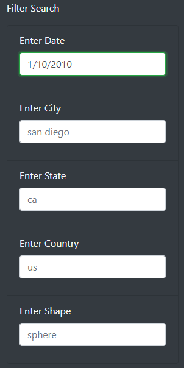
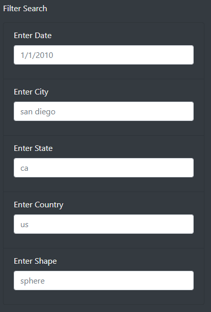

# UFOs

## Overview of Project
### Purpose
The purpose of this project is to analyze UFO sighting data and allow users to filter for criteria of `city`, `state`, `country`, and `shape`. A table is created with JavaScript to filter the data based on specific criteria. The table is fully dynamic and reacts to user input.

[Click here to view the live project!](https://matin-n.github.io/UFOs/)

## Results
### How to perform a search
#### Filter Search

Navigate to the Filter Search form and modify any of the following parameters 

- Date (MM/DD/YYYY)
- City (city name)
- State (two letter abbreviation)
- Country (two letter abbreviation)
- Shape  

#### Clear Search
There are two ways to clear the filters:

Navigate to Navbar Header and click on "UFO Sightings"

Navigate to Filter Search form and delete all of the parameters

## Summary
The UFOs filter is a functional project; however, it has drawbacks to the design.

For instance, the data is not pre-processed and is not standardized. To elaborate, a user may filter by state and input `California` or `CA`, and there would be no filtered results. There are no filtered results because the current dataset has all states in an abbreviated lowercase format. The existing design only matches identical results. An ideal scenario would pre-process all state data into a specific standard such as the `ANSI standard INCITS 38:2009`. Finally, the state textbox would be removed and switched with a dropdown box with all available states.

Another suggestion, the date textbox datatype can be switched from `text` to `date`. Ideally, the date data would be pre-processed and formatted according to `ISO8601`. The `date` datatype brings benefits to reduce user input error and allow usage of the `max` and `max` attributes. Additionally, a range of dates could be filtered rather than limited by a singular date.

A final suggestion would be to allow the user to sort the table's data in ascending or descending order according to any specific columns.
